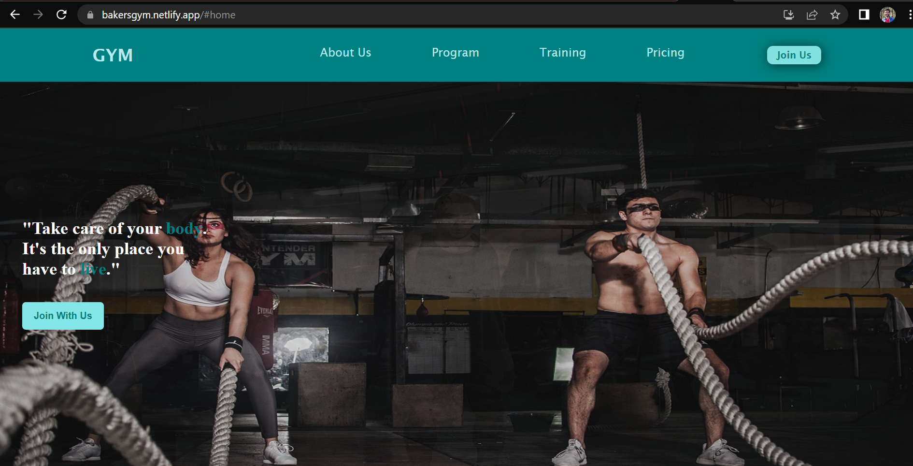
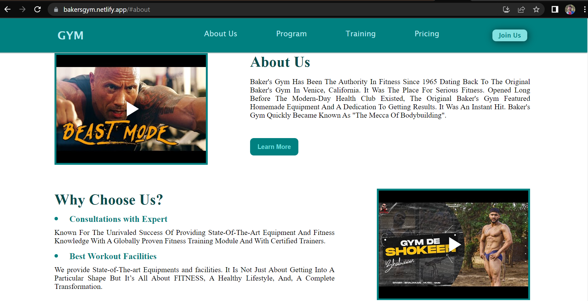
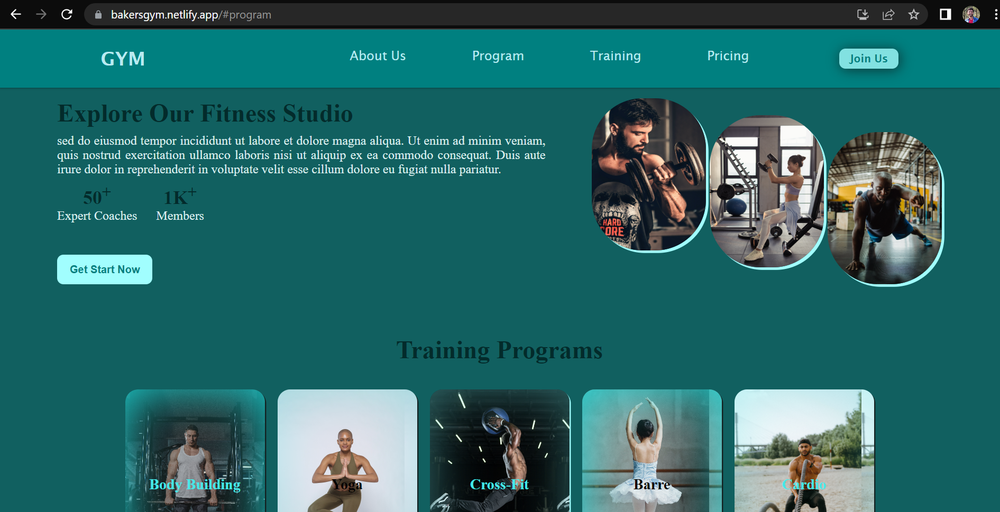
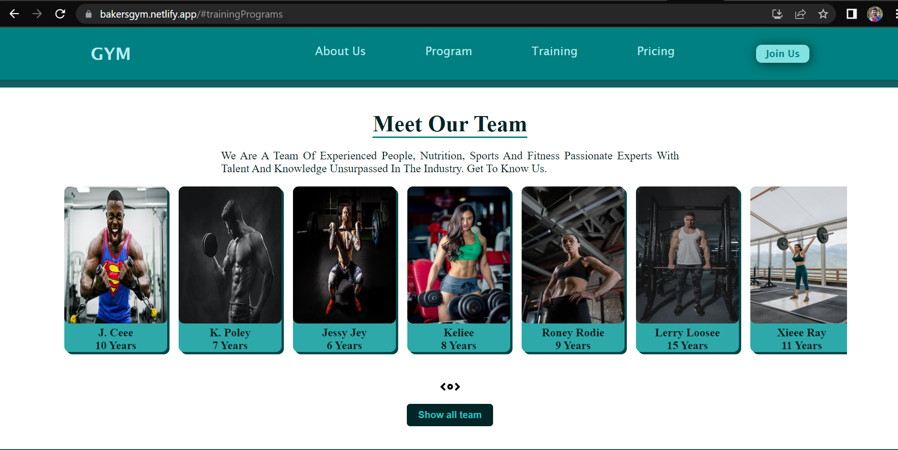
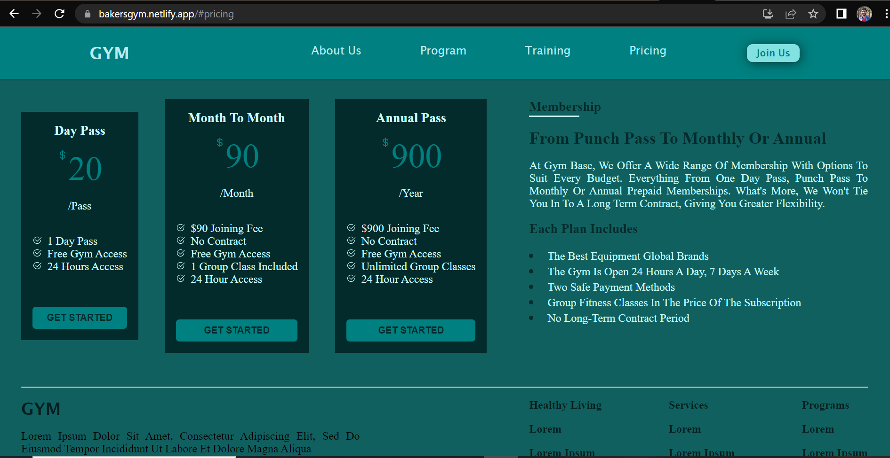
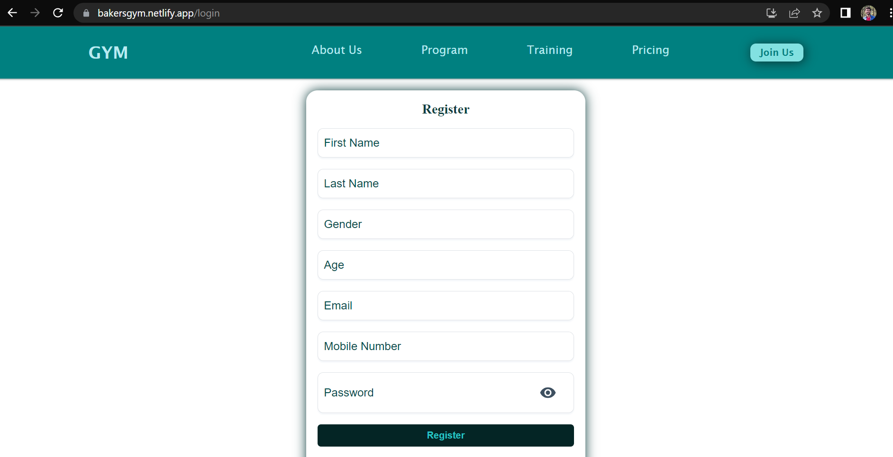

# WELCOME TO BAKER'S GYM
# Gym Website: using React

<ul>
  <li> Baker's gym is a template of gym website which contains multiple scrollable pages and functional components. It is a blend of react.js with react-router-hash-link, react-router-dom, react-player, sweetalert2, react-icons, and material UI</li>
  <li> Gym website facilitates it's visitors to have a look over tarining programs, team and Plans that Baker's Gym provide</li>
  <li> The website is responsive means can be acessed in any device</li>
</ul>

# Deployment Site Link

open [https://bakersgym.netlify.app/](https://bakersgym.netlify.app/) in your browser to have a look at Baker's Gym

## Some Glimpses

## Tech Stack used in this project

<ol>
  <li>react.js</li>
  <li>CSS</li>
  <li>react-router-hash-link</li>  
  <li>react-router-dom</li>
  <li>react-player</li>
  <li>material UI</li>
  <li>sweetalert2</li>
  <li>react-icons</li>
</ol>

## Author

Pramod Kumar [https://github.com/Pramod-Kumar07/Gym-website](https://github.com/Pramod-Kumar07/Gym-website)

### Install 

npm install 

### Usage

npm run start

### Run Tests

npm run test

### `npm start`

Runs the app in the development mode.\
Open [http://localhost:3000](http://localhost:3000) to view it in your browser.

## Show Support

Thank you so much already for using my projects! If you want to go a step further and give a 

